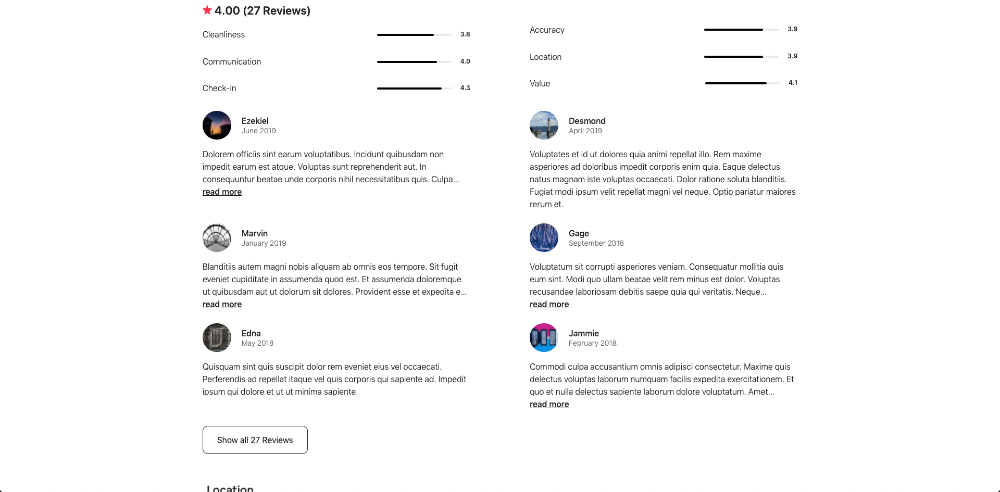
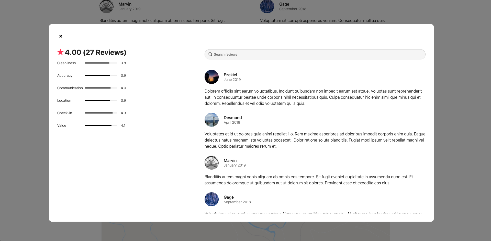
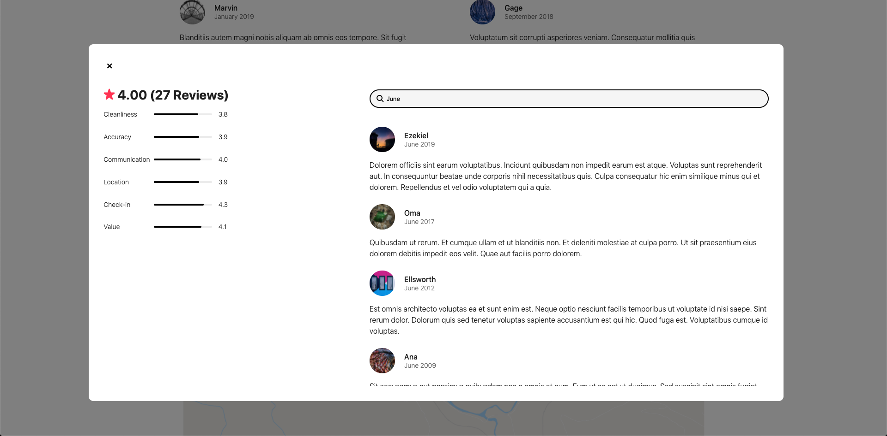

# Project Name
MERN Vacation Rental Booking Application

This is the reviews component which allows users to read average ratings and all user reviews for a particular listing. Allows you to search reviews by keywords.

## Preview





## Related Projects

  - https://github.com/hrsf131-3-group/image-carousel-service.git
  - https://github.com/hrsf131-3-group/reservations-service.git
  - https://github.com/hrsf131-3-group/reviews-service.git
  - https://github.com/hrsf131-3-group/more-places-service.git

## Table of Contents

1. [Seeging](#Seeding)
1. [Usage](#Usage)
1. [Requirements](#requirements)
1. [Development](#development)

## Seeding
```
Run "npm run seed-db" command to generate data and store it in database
```

## Usage
```
Run "npm install" to install all dependencies
Run "npm start" to start server at localhost 3003
```

## Requirements
```
An `nvmrc` file is included if using [nvm](https://github.com/creationix/nvm).

- Node 6.13.0
- etc
```

## Development
```
Run "npm run react-dev" to start webpack
```

